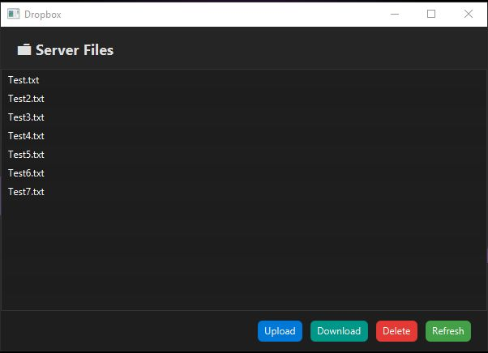

A client-server application for file uploading, downloading, and storage.
UI: Built with JavaFX, featuring drag & drop support
Server: Uses Java NIO selectors for single-threaded multiplexing
Protocol: Custom binary format:
``` Protocol
[Magic: 2 bytes] [Operation: 1 byte] [JSON Length: 4 bytes] [Binary Length: 8 bytes] [JSON payload] [Binary payload]
```
Each client has a dedicated packet queue to maintain byte order
Auto-reconnect feature in the client if connection is lost


<picture>
 <source media="(prefers-color-scheme: dark)" srcset="[[https://github.com/GiperB0la/GiperbolaBook/blob/main/Screen.png](https://github.com/GiperB0la/Dropbox/blob/main/Screen.jpg](https://github.com/GiperB0la/Dropbox-Java/blob/main/Screen.jpg))">
 <source media="(prefers-color-scheme: light)" srcset="YOUR-LIGHTMODE-IMAGE">
 
</picture>
